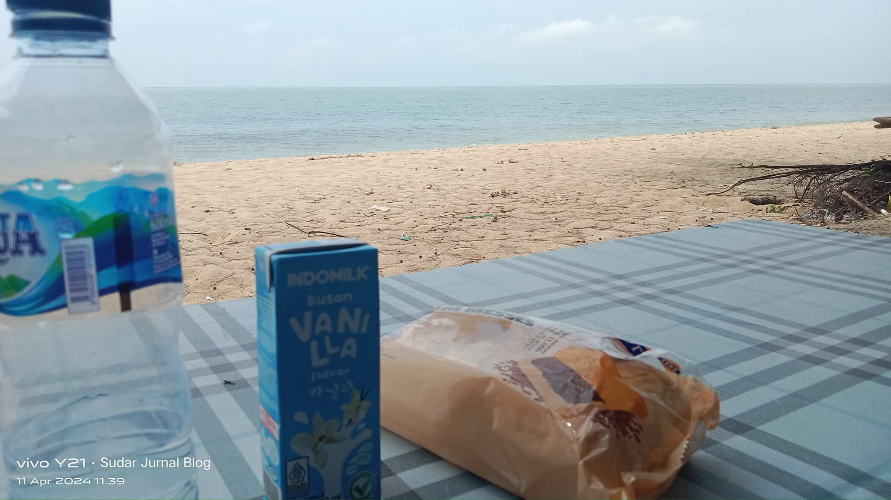
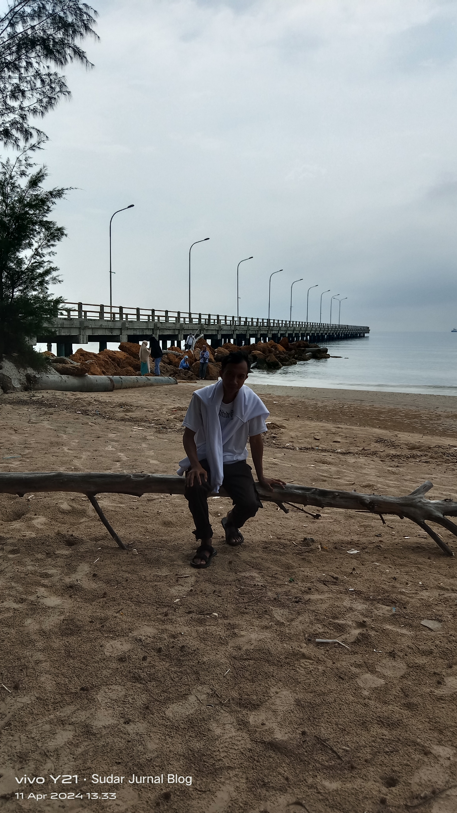
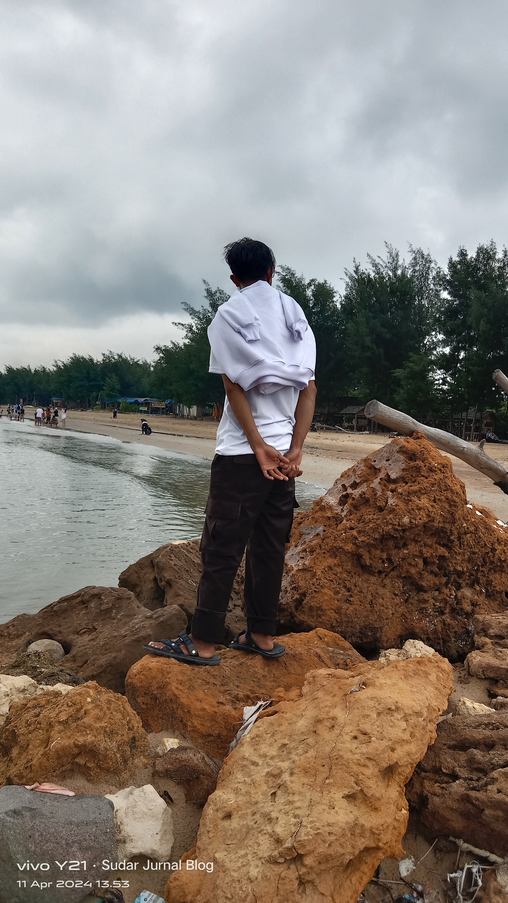

Akhirnya puasa sudah berakhir dan sekrang sudah memasuki hari raya idul fitri, saya idul fitri kali ini memutuskan untuk keluar jalan - jalan yang mana karena pada tahun baru kemarin saya tidak kemana - mana jadi agenda nya yang jalan - jalan adalah saat lebaran.

Sekali lagi saya memutuskan ke tuban karena dekat dan tidak membutuhkan banyak biaya untuk kesana. Saya ke tuban tidaklah sendiri dimana dengan ajak teman saya yang bernama wafa karena dia yang lebih mengerti jalur dari pada saya.

Tujuan awal saya yaitu ke Pantai Remen Pasir Putih yang mana dulu sangatlah terkenal di tuban, bagi yang sering ke tuban tentu sudah hafal kalau tuban itu pantai nya banyak banget bahkan di seluruh panjang pantura pun kita akan tau kalau ada pantai bagus disana. 

Awalnya tujuan saya ingin ke Pantai Cemara karena kata teman ku lebih bagus dari san pantai remen maka saya berniat untuk kesana aja. 

## Perjalanan 2 Jam Lebih Dari Rumah
Berangkat dari Sukorame tempat rumah teman saya, awal berangkat nya pun sekitar siang sekitar jam 09 dari rumah dan sampai tujuan itu sekitar jam setengah 12 an. Karena jalanan macet dan ditambah lagi mampir membeli bensin serta cari map pas di kota tujuan kita kemena.

Dari kota tuban sudah macet karena bebarengan dengan para pemudik yang pulang dan balik ke kampung halaman ditambah lagi pas di pom bensin antri nya panjang banget mungkin ada sekitar setengah jam lah antri untuk membeli bensin. 

## Disambut Hujan Saat di Tuban
Setelah di tuban saya di sambut dengan hujan rintik - rintik karena hujannya belum deras akhirnya saya tetap trabas aja sampai ke tempat tujuan. Ku kira tidak akan sampai disana akan tetapi alam berkata lain malah tuban sering banget hujan di bandingkan di lamongan. 

Dari pusat kota dimana saya kehujanan itu dari pantai remen masih jauh sekitar 30 menitan jadi mau gak mau harus lanjut mending hujan - hujan sudah di sana. 

## Tiket Pantai Putih Murah Ku Kira Mahal

Setelah sampai disana ternyata agar bisa masuk ke Pantai nya harus membayar tiket cuma 5 ribu saja, ku kira tiket masuk nya mahal seperti yang ada di pantai kelapa yaitu 10 ribu belum parkir nya juga. 

Tapi tidak, hanya bayar 5 ribu kalian sudah bisa bermain sepuasnya disana. 

Entah apa pesona pantai remen ini yang mana banyak orang ingin pergi kesana, perasaan sama aja dengan pantai yang ada di tuban. Bagi kalian yang ingin menikmati ketengan kayaknya pantai ini sangatlah cocok.

Saya pas datang kesana tidak lah ramai seperti biasa nya Pantai Remen ini sangatlah sepi yang mana banyak pengunjung yang datang dan pergi ke tempat tersebut.

Saya sendiri juga baru tau kalau pantai remen ini jauh di pelosok desa yang mana dekat dengan kilang pertamina yang ada di tuban, tentu kalau ada apa - apa sangatlah berbahaya sih menurut saya pribadi.
 
Saya nikmati pantai ini sekitar 1 jam disana karena tenang tidak bergitu banyak orang jadi kalau mau foto - foto jadi tidak malu. 

Seperti biasa nya kalau ke tuban tidak pesen rujak orang sana kayak tidak lah seru, karena setiap di pantura ada penjual rujak.

Di Pantai Remen Tuban ini walaupun banyak orang dagang juga ada banyak fasilitas seperti WC umum, Masjid, WarungMakan apabila kalian laper, dan masih banyak lagi.

Apabila kalian ingin kesana dan bingung jalan nya kalian bisa menggunakan map karena letak pantai nya berada di desa jadi agak sulit untuk menemukan pantai tersebut. 

Setelah dari pantai remen tuban akhirnya saya lanjut lagi ke pantai yang selanjut nya bernama Pantai Dermaga yang mana pantai tersebut sempat viral di tiktok dan membuat saya penasaran juga.

## Penasaran Dengan Pantai Telaga Tuban

Pantai Dermaga ini kalau dari Pantai Remen Tuban ini tidaklah jauh sekitar 4 kilometer dan itu pun lewat jalan desa bukan jalan pantura lagi. 

Wisata ini kemaren sangatlah sepi tidaklah begitu banyak pengunjung seperti halnya di tiktok mungkin habis gempa mungkin banyak wisata di tuban yang sepi tidak seperti biasanya yang rame bahkan membludak sampai tidak ada tempat untuk duduk. 

## Lokasi Pantai Dermaga
Penasaran Dengan Pantai Telaga Tuban

Jika kalian mencari lokasi pantai ini sangatlah gampang dimana lokasi nya tidak lah jauh dari pantai Remen Tuban, Pantai ini berada di Desa Purworejo, Kec Jenu Tuban. 

Pantai ini sangatlah bagus apabila melihat terbitnya matahari dari tempat ini karena banyak wisatawan yang ingin berburu sanset di pantai ini. 

## Harga Tiket Masuk

Untuk harga nya terbilang murah dimana di patok 5 ribu untuk motor dan 10 ribu untuk mobil, menurut saya sendiri itu word it lah ya karena pantai nya masih sepi dan belum banyak yang jualan disana. 

Di Pantai Dermaga ini ada kaya seperti dermaga yang mana untuk kapal bersandar milik sebuah perusahaan oleh karena itu mungkin dinamakan pantai dermaga oleh penduduk sekitar.

Pantai Dermaga ini juga masih terbilang sangatlah bersih karena belum banyak pengunjungnya ditambah lagi ada saung yang mana kalian bisa istirahat disana. 

Ada sekitar 5 saung bisa kalian pilih sambil menikmati indahnya pantai dermaga ini.

## Akhir Kata

Di Tuban Emang Banyak Loakasi Pantai Indah Ditambah lagi harga masuk serta parkirnya pun sangatlah murah jadi jangan takut harga nya itu mahal. 
